# Getting Started

A visual walkthrough of the Vault web UI and its key features.

## Dashboard

When you first open Vault, the Dashboard greets you with a welcome screen and a 3-step guide to get started: add a storage destination, create a backup job, and run your first backup.

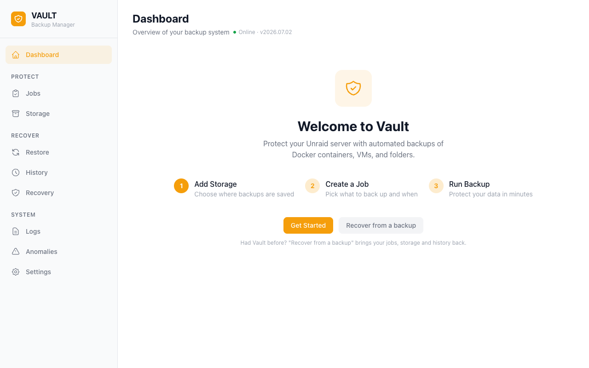

The welcome panel walks you through the setup steps with clear numbered guidance.

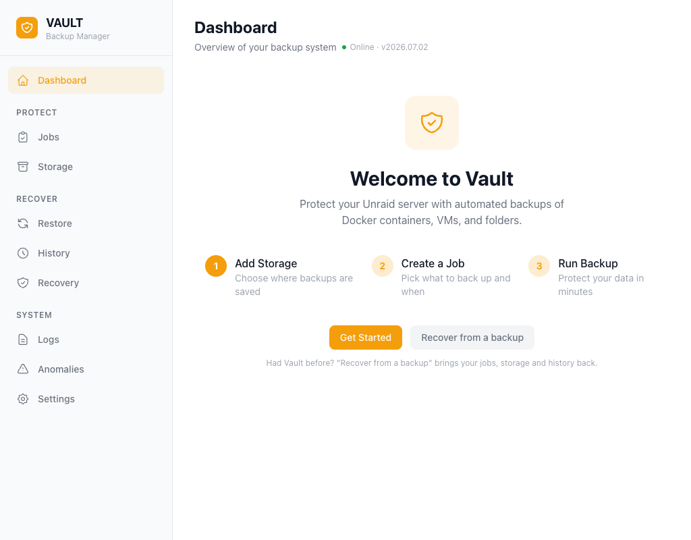

## Storage

The Storage page is where you configure backup destinations. Vault supports local paths, SFTP, SMB, and NFS. Add a destination, test the connection, and you're ready to go.

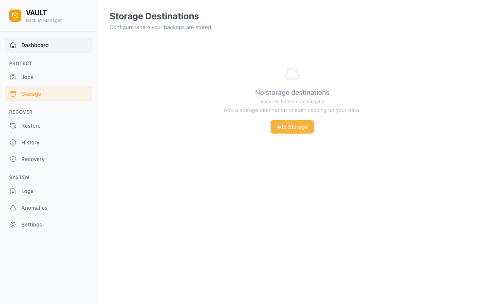

## Jobs

The Jobs page lets you create and manage backup jobs. Each job defines what to back up (containers, VMs, folders), which storage destination to use, a schedule, and retention rules.

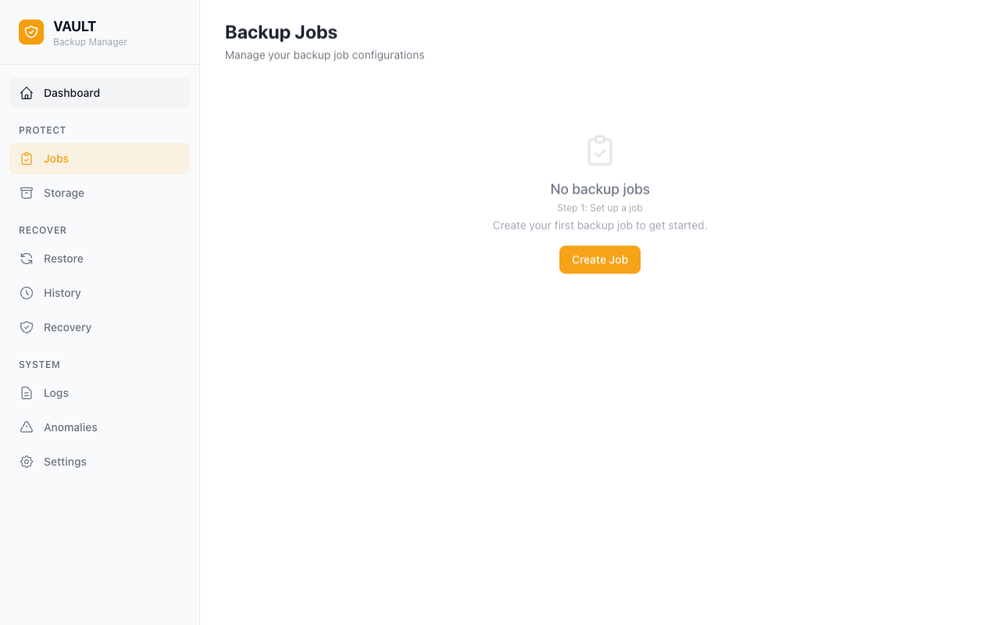

## History

The History page shows a log of all completed, failed, and running backup jobs. Each entry includes the job name, duration, size, and status.

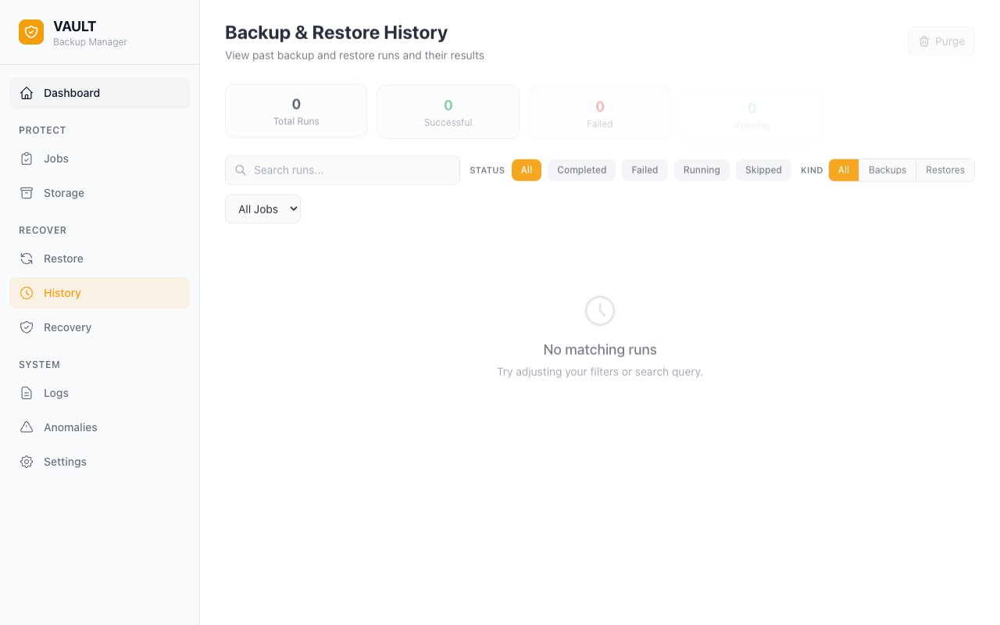

## Restore

The Restore page provides access to the restore wizard. Select a job, pick a restore point, choose specific items to restore, and confirm.

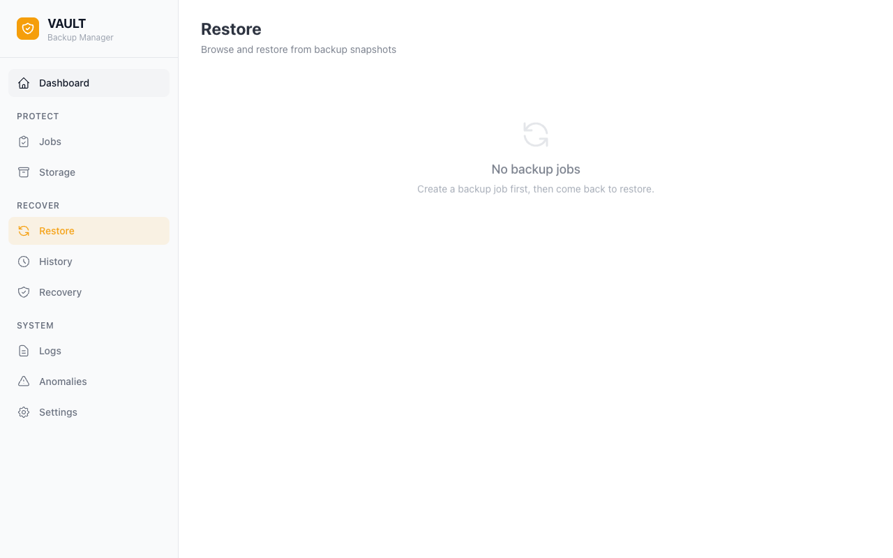

## Logs

The Logs page shows a chronological activity log of system events — job runs, storage tests, configuration changes, and errors.

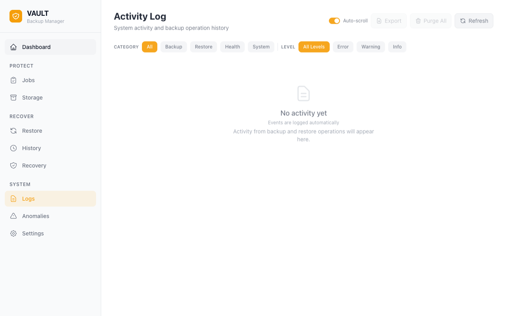

## Replication

The Replication page lets you replicate backup data from remote Vault instances to your local server. This supports the offsite copy in a 3-2-1 backup strategy.

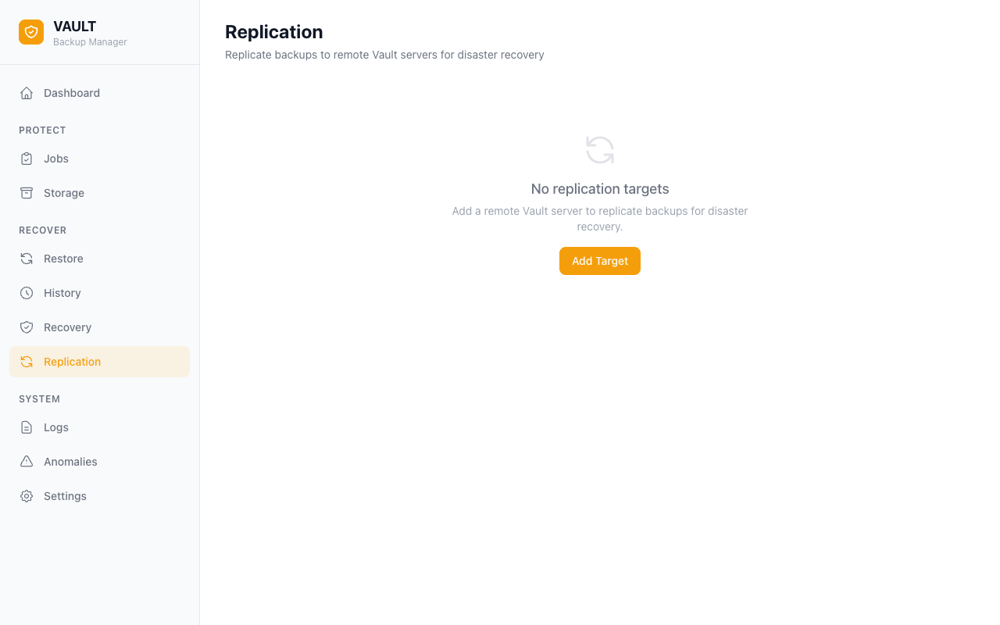

## Recovery

The Recovery page provides a disaster recovery guide with step-by-step instructions for restoring your server from backups.

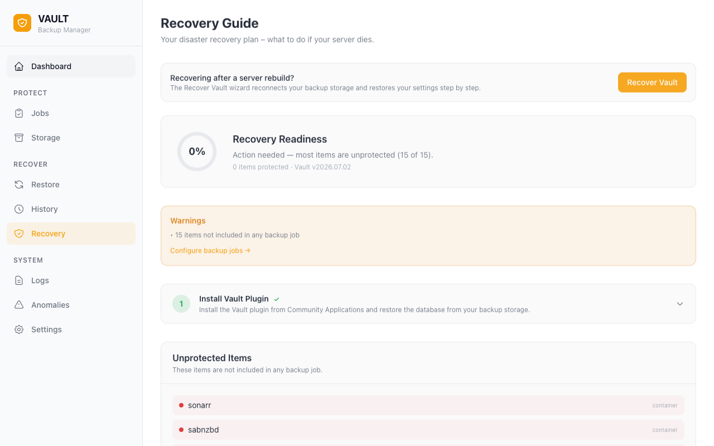

## Settings

The Settings page provides configuration options for encryption, staging directory, database snapshots, Discord notifications, and theme selection.

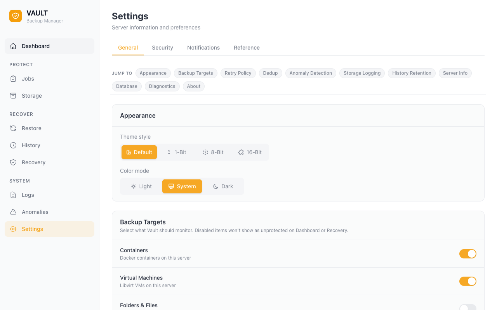

## Mobile View

Vault is fully responsive. On mobile devices, the sidebar collapses into a bottom navigation bar with quick access to the main pages.

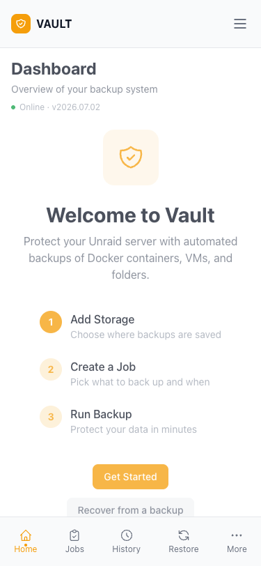

## Dark Mode

Toggle between light and dark themes using the theme button in the sidebar. Dark mode uses a warm dark palette that's easy on the eyes.

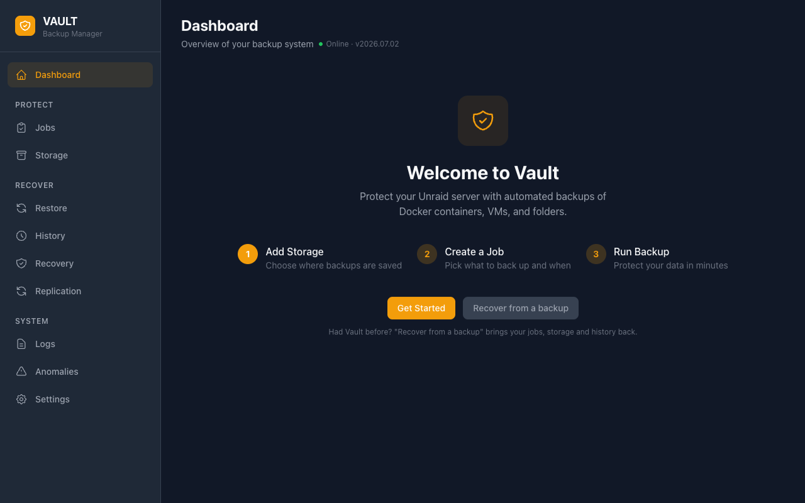
