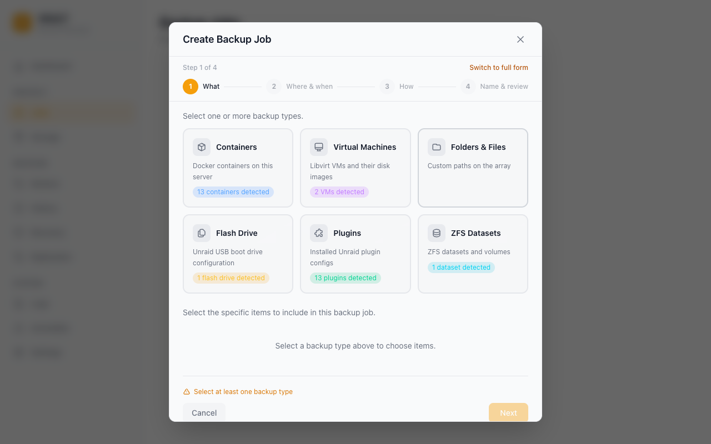

# Backup Jobs

A backup job defines _what_ to back up, _where_ to put it, _when_ to run, and how many copies to keep. This guide explains every option in the job wizard.

## Creating a Job

Go to **Jobs** → **Create Job**. The wizard has four steps.

---

### Step 1 — What

Pick which items to include in this job. Vault discovers items automatically from your server:

| Category             | What's included                                                                                      |
| -------------------- | ---------------------------------------------------------------------------------------------------- |
| **Containers**       | Docker containers (image, XML template, and all mapped appdata volumes); per-container path excludes |
| **Virtual Machines** | libvirt VMs (live snapshot or cold backup depending on running state); NVRAM preserved               |
| **ZFS datasets**     | Native `zfs send`/`receive` with snapshot management                                                 |
| **Folders**          | Any arbitrary path on your server (e.g. `/mnt/user/appdata`, `/boot/config`)                         |
| **Plugins**          | Installed Unraid plugins                                                                             |

#### Notes on containers

- Vault backs up the container image, its XML template, and all host paths mapped into the container.
- Special files (Unix sockets, device nodes, named pipes) are skipped automatically — they cannot be archived and their presence does not fail the backup.
- Tailscale-enabled containers are fully supported.
- Bind-mounts that point at the host root (`/` → `/rootfs`, used by Glances, Telegraf, Netdata, cAdvisor, node-exporter) are detected and skipped without walking the host filesystem.

#### Excluding container sub-paths

You can list paths to exclude from a container backup (e.g. `/config/Library/Application Support/Plex Media Server/Cache` or `/config/Sonarr/MediaCover`). The job wizard exposes a free-text list per container, and Vault ships a `GET /api/v1/presets/exclusions` catalogue of common rules for popular containers (Plex, Sonarr, Radarr, etc.) the UI offers as starting points. For some apps the response also carries advisory `notes`/`warnings` (e.g. the Immich database caveat below), which the wizard shows inline.

#### Backing up Immich

Immich detection works for both the official `ghcr.io/immich-app/immich-server` image (media root mounted at `/data`) and the imagegenius fork `ghcr.io/imagegenius/immich` (`/photos`). The recommended exclusions cover both layouts:

|                         | Always backed up (critical)               | Excluded (regeneratable)  |
| ----------------------- | ----------------------------------------- | ------------------------- |
| Official (`/data`)      | `upload`, `library`, `profile`, `backups` | `thumbs`, `encoded-video` |
| imagegenius (`/photos`) | `upload`, `library`, `profile`, `backups` | `thumbs`, `encoded-video` |

Thumbnails and re-encoded video are re-created by Immich on demand after a restore, so excluding them saves space without data loss. The `upload`/`library`/`profile` folders hold your original photos and videos and are never excluded.

**Immich's database is the catch:** Immich stores every asset's metadata in a **PostgreSQL database that runs in a separate container**, so a filesystem backup of the Immich container does _not_ capture it — and a raw file copy of the Postgres data directory is not crash-consistent. Choose one of:

1. **Recommended — Immich's built-in database backup.** In Immich, go to **Administration → Settings → Backup Settings** and enable the database dump. Immich writes timestamped `.sql.gz` dumps into the `backups/` folder inside your media root (`/data/backups` or `/photos/backups`), which Vault keeps. Backing up the media root then captures both your photos and a restorable database dump in one job.
2. **Back up the Postgres container as its own Vault job.** Add the Immich Postgres container to a separate job; Vault stops it before archiving, giving a consistent copy of its data directory.
3. **Dump via a pre-backup script.** Vault runs a job's **Pre-backup script** before stopping any containers, with `VAULT_JOB_NAME`, `VAULT_STATUS`, `VAULT_JOB_ID`, and `VAULT_RUN_ID` exported into its environment. A script can `docker exec` a `pg_dump` into the media root before the backup runs.

#### Notes on ZFS datasets

- Vault uses `zfs send` (full) and `zfs send -i` (incremental) under the hood and manages the snapshot lifecycle itself.
- Restoration goes through `zfs receive`, preserving properties and child datasets.
- The host `zfs` binary must be on `PATH` — true on any Unraid system with a ZFS pool.

#### Notes on folders

- You can back up `/mnt/user/appdata` to get all container appdata in one shot without selecting individual containers.
- Folder backups only wake the destination disk when writing — the source array is read sequentially.

---

### Step 2 — Where & when

Select which storage destination this job will write to. If you have not added one yet, save the wizard and go to **Storage** first — see [Storage Destinations](storage-destinations.md). This step also sets the schedule.

#### Schedule

| Option            | Description                                                                |
| ----------------- | -------------------------------------------------------------------------- |
| **Hourly**        | Runs at a fixed minute past every hour                                     |
| **Daily**         | Runs at a specific time each day                                           |
| **Weekly**        | Runs on selected days of the week at a specific time                       |
| **Monthly**       | Runs on a specific day of the month (or First/Last day) at a specific time |
| **Yearly**        | Runs on a specific month and day at a specific time                        |
| **Custom (cron)** | Any valid cron expression for advanced schedules                           |

**"First day" and "Last day" of month:**
Instead of a fixed day number, you can choose _First day of month_ or _Last day of month_. Last-day jobs fire correctly on months of any length (28, 29, 30, or 31 days).

**Time format:**
The schedule UI uses your Unraid time format setting (12-hour or 24-hour) automatically.

> **Manual-only jobs:** Leave the schedule empty to create a job that never runs on its own — you run it on demand with the **Run Now** button.

---

### Step 3 — How

Choose the backup strategy and, under _Advanced options_, tune compression, retention, verification, and scripts.

#### Backup Types

| Type             | What it backs up                          | Restore speed                        | Storage use                   |
| ---------------- | ----------------------------------------- | ------------------------------------ | ----------------------------- |
| **Full**         | Everything, every run                     | Fastest — single archive             | Highest — full copy each time |
| **Incremental**  | Changes since the last backup of any type | Slowest — may need to chain archives | Lowest                        |
| **Differential** | Changes since the last _full_ backup      | Medium — needs full + one diff       | Medium                        |

For most home server use cases, a weekly **Full** backup with daily **Incremental** runs gives a good balance between storage cost and restore speed.

#### Retention

Retention controls how many restore points are kept before the oldest is deleted. (A _restore point_ is one completed backup you can restore from.) Vault supports two modes. If any Long-Term Retention value is set, LTR is used and the simple settings are ignored.

**Mode 1 — Simple count**

| Field                          | Description                                                                                                                                                                |
| ------------------------------ | -------------------------------------------------------------------------------------------------------------------------------------------------------------------------- |
| **Keep last N restore points** | Vault keeps this many restore points per job. When a new backup completes and the count exceeds the limit, the oldest is pruned — including its backup files from storage. |

Good for "always keep my last 7 backups" type policies.

**Mode 2 — Long-Term Retention (LTR)**

| Field            | Description                                                                          |
| ---------------- | ------------------------------------------------------------------------------------ |
| **Keep latest**  | Number of _most-recent_ restore points kept unconditionally (independent of cadence) |
| **Keep daily**   | Number of distinct _days_ to retain (one restore point per day)                      |
| **Keep weekly**  | Number of distinct _weeks_ (one restore point per week)                              |
| **Keep monthly** | Number of distinct _months_ (one restore point per month)                            |
| **Keep yearly**  | Number of distinct _years_ (one restore point per year)                              |

Long-Term Retention (LTR) lets you keep, say, "last 7 days + last 4 weeks + last 6 months + last 3 years" without paying for hundreds of restore points. The Job UI shows a _retention preview_ — exactly which restore points the policy would prune on the next run — before you save.

If you leave all LTR counters at 0, classic simple retention applies. If any LTR counter is greater than 0, Vault uses LTR for that job and ignores the simple settings (_Keep last N_ and _keep-for-N-days_).

Set retention based on storage budget and how far back you want to be able to restore:

- 7 daily backups → simple count = 7
- A weekly full + 6 daily incrementals → simple count = 7, two jobs (one weekly full, one daily incremental)
- Year of history without storage bloat → LTR with `keep_daily=7`, `keep_weekly=4`, `keep_monthly=12`, `keep_yearly=3`

---

### Step 4 — Name & review

| Field    | Description                                                                     |
| -------- | ------------------------------------------------------------------------------- |
| **Name** | A unique name for this job. Shown on the Dashboard, History, and Restore pages. |

Check the plain-language summary of what the job will do, then click **Save**.

---

## Running a Job Manually

To trigger an immediate backup without waiting for the schedule:

1. Go to **Jobs**
2. Click the **Run Now** button on the job card (play icon)

Progress streams in real time via WebSocket. The run appears in **History** when complete.

---

## Monitoring Progress

While a job is running:

- The Dashboard shows a live progress indicator
- The **History** page lists the run with status "Running"
- The **Logs** page shows per-item progress entries including container name, backup type, storage destination, and elapsed time

---

## Cancelling a Running Job

To stop an in-progress backup:

1. Go to **Jobs**
2. Click the **Cancel** button on the running job

Vault signals cancellation through the entire pipeline — file I/O, directory traversal, and engine handlers all check for cancellation and stop gracefully. The job is marked as "cancelled" in History.

Jobs also have an automatic safeguard:

- **2-hour stall detection** — a job with no progress for 2 hours is cancelled (with a warning at 30 minutes). There is no overall time limit: a backup that is still transferring data can run for as long as it needs.

---

## Deleting a Job

To delete a job:

1. Go to **Jobs**
2. Click the **...** menu → **Delete**
3. Choose whether to **Keep backup files** or **Delete backup files** from storage

Deleting backup files removes the archives from the storage destination. Keeping them leaves the files in place — useful if you plan to import them into a new job later.

---

## Deleting Individual Restore Points

To delete a specific backup without touching the job or other restore points:

1. Go to **Restore** in the left sidebar
2. Select the job
3. Find the restore point and click the **trash icon**
4. Confirm the deletion

This removes both the backup files from storage and the restore point record from the database.

---

## Managing Stale Items

If a container, VM, ZFS dataset, or folder is removed from Unraid after a job is created, Vault marks it as **"Not found"** in the job's item list. Click the **remove** button next to the flagged item to drop it from the job. The Folder picker performs an async `os.Stat` (via `GET /api/v1/path-exists`) for every custom folder on mount, so legitimately valid paths aren't falsely flagged.

---

## Verification

Every backup item is hashed with SHA-256 during the upload, and Vault stores the digest alongside the restore point. Two verification layers exist on top of that:

- **Per-run verify** — when the job's _Verify backup_ setting is on (default), each item is read back from storage at the end of the run and re-hashed. Mismatches fail the run.
- **On-demand verify** — from the Restore page you can click _Verify_ on any individual restore point at any time. The result, including per-item byte counts and errors, is stored under `verify_runs` and listed in the restore point's verify history.

Both paths use the same code, so per-run and on-demand results are directly comparable.

---

## Encryption

If you set a passphrase under **Settings → Security → Encryption**, all backup archives are encrypted with your backup password (age encryption — a modern, audited standard) before they leave the host. Without the passphrase, restoring is not possible. Encryption is transparent to storage destinations — it applies equally to local, SFTP, SMB, NFS, WebDAV, and S3.

The encryption status is shown on the Dashboard's 3-2-1 compliance widget, and on each restore point's chain-health badge.

---

## Deduplication

Deduplication stores each unique piece of data only once, so repeated data across runs and sources doesn't cost extra space — see [How Backup Works](../how-backup-works.md#deduplication) for the concept. The rest of this section covers the operational details.

When you enable _Dedup_ on a storage destination, Vault chunks every backup with Keyed-FastCDC (256 KiB / 1 MiB / 4 MiB min/avg/max) and stores only one copy of each chunk in a per-destination dedup repo at `<dest>/_vault/packs/` and `<dest>/_vault/index/`. The repo's chunker is keyed off a 32-byte secret per destination, which closes the fingerprinting-attack class described in Truong et al. 2025 — observers without the secret can't recompute chunk boundaries from public corpora.

Operational notes:

- Each backup writes a per-item manifest into the dedup repo. The `manifest_id` (or `item_manifests` map for multi-item jobs) is stored on the restore point so restores can resolve chunks.
- The Storage card shows live dedup stats (chunks, packs, logical/physical bytes, dedup ratio).
- `vault dedup gc --dest <id>` (or `POST /api/v1/storage/{id}/gc`) runs mark-and-sweep GC: walks every live restore point's manifest, marks reachable chunks, then deletes packs whose every chunk is unreachable. Mixed packs are left in place.
- `vault dedup repair --dest <id>` rebuilds the SQLite chunk/pack index from the on-storage `*.idx` blobs — use when the local DB is lost or corrupted but the destination is intact.
- Dedup-mode and non-dedup destinations can coexist on the same Vault install; the flag is per-destination and immutable after creation.

Imported backups (Storage → _Scan_ + _Import_) carry per-item dedup manifest IDs in their `manifest.json`, so dedup restore points produced on one Vault instance can be re-discovered and restored on another.

---

## Next steps

- Point your job at the right target: [Storage Destinations](storage-destinations.md)
- Let Vault warn you when backups drift from normal: [Anomaly Detection](anomaly-detection.md)
- Make sure you can recover if the server dies: [Disaster Recovery](disaster-recovery.md)
