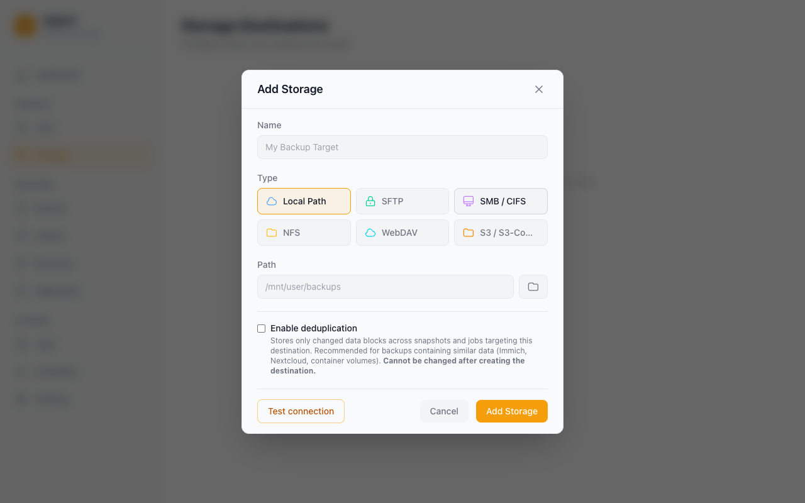

# Storage Destinations

Every destination card has a **Browse** button that opens a read-only file browser — drill into folders like an FTP client to see exactly what Vault sees on the destination. It never writes anything, so it's also available in replica mode.

Vault writes compressed (and optionally encrypted) backup archives to a storage destination. This page explains how to configure each supported type.

## Overview



| Type       | When to use                                                                                 |
| ---------- | ------------------------------------------------------------------------------------------- |
| **Local**  | Unraid array share, directly attached USB/SSD, or any locally mounted path                  |
| **SFTP**   | Any Linux/BSD server reachable by SSH — another NAS, a VPS, a cloud VM                      |
| **SMB**    | Windows shares and Samba servers; common for Synology and TrueNAS SCALE                     |
| **NFS**    | NFS exports from Linux/BSD servers and most NAS devices                                     |
| **WebDAV** | Stateless HTTP backup target — Nextcloud, ownCloud, Synology WebDAV, generic WebDAV servers |
| **S3**     | AWS S3 and S3-compatible object storage — Backblaze B2, MinIO, Cloudflare R2, Wasabi        |

---

## Local

| Field    | Description                                                                                                                               |
| -------- | ----------------------------------------------------------------------------------------------------------------------------------------- |
| **Path** | Absolute path where Vault will write backups (e.g. `/mnt/user/backups`). The directory must exist and be writable by the `vault` process. |

**Notes:**

- Local destinations are the fastest option — no network overhead.
- Avoid putting backups on the same array as the source data if you want protection against disk failure.
- Vault only wakes the destination disk when it needs to write; it does not keep disks spinning between runs.

---

## SFTP

| Field           | Description                                                                                                                                                           |
| --------------- | --------------------------------------------------------------------------------------------------------------------------------------------------------------------- |
| **Host**        | Hostname or IP of the SSH server                                                                                                                                      |
| **Port**        | SSH port (default: `22`)                                                                                                                                              |
| **Username**    | SSH user with write access to the remote path                                                                                                                         |
| **Password**    | Password for the SSH user (not required if using a key)                                                                                                               |
| **Remote Path** | Absolute path **on the SSH server** where Vault will store backups (e.g. `/volume1/vault-backups`). The directory must exist and the user must have write permission. |

**Tips:**

- Prefer key-based authentication for unattended backups. Add the Unraid server's public key (`~/.ssh/id_rsa.pub`) to the remote user's `~/.ssh/authorized_keys`.
- Test the connection before saving — Vault will attempt to list the remote directory and report any permission or connectivity errors.
- SFTP is the most broadly supported remote protocol and works with virtually any server running OpenSSH.

---

## SMB / CIFS

| Field        | Description                                                                                                                           |
| ------------ | ------------------------------------------------------------------------------------------------------------------------------------- |
| **Host**     | Hostname or IP of the SMB server                                                                                                      |
| **Share**    | The top-level SMB share name as configured on the server (e.g. `Backups`). This is the share name only — not a path.                  |
| **Path**     | Optional sub-folder **within the share** where Vault will write its data (e.g. `vault/my-server`). Leave blank to use the share root. |
| **Username** | SMB user with write access                                                                                                            |
| **Password** | SMB password                                                                                                                          |
| **Domain**   | Windows domain (leave blank for workgroup/Samba)                                                                                      |

**Understanding Share vs Path:**

```
SMB server: \\nas\Backups\vault\my-server
             └── host   └── share
                              └── path (sub-folder within share)
```

The **Share** field maps to the first component after the hostname. The **Path** field is everything after that.

**Tips:**

- SMB is the best choice for Synology NAS, Windows Server, and TrueNAS SCALE.
- Vault enforces a 30-second dial timeout so a misconfigured SMB destination will fail fast rather than hanging.

---

## NFS

| Field           | Description                                                                                                                                                          |
| --------------- | -------------------------------------------------------------------------------------------------------------------------------------------------------------------- |
| **Host**        | Hostname or IP of the NFS server                                                                                                                                     |
| **Export Path** | The path the NFS server exports — matches the entry in `/etc/exports` on the server (e.g. `/mnt/user/backups`). This is what gets mounted, not a sub-path within it. |
| **Base Path**   | Optional sub-directory **within the mounted export** where Vault will write its data. Leave blank to use the export root directly.                                   |

**Understanding Export Path vs Base Path:**

```
NFS server exports: /mnt/user/backups
                     └── export path (what gets mounted)

Vault writes to:    /mnt/user/backups/vault/my-server
                                      └── base path (sub-folder within mount)
```

**Tips:**

- The export path must be listed in `/etc/exports` on the NFS server and the Unraid server's IP must be allowed.
- NFS v3 is used by default. Ensure the `nfs-utils` package or equivalent is installed on the server.
- NFS offers the lowest overhead for LAN backups to a Linux-based NAS.

---

## WebDAV

| Field                                  | Description                                                                                                                                                                                                        |
| -------------------------------------- | ------------------------------------------------------------------------------------------------------------------------------------------------------------------------------------------------------------------ |
| **Server URL**                         | Full URL to the WebDAV endpoint, e.g. `https://nextcloud.example.com/remote.php/dav/files/username/` for Nextcloud or `https://webdav.example.com/` for a generic server. Must start with `http://` or `https://`. |
| **Username**                           | WebDAV username (leave blank for anonymous access — not recommended for production).                                                                                                                               |
| **Password / App Token**               | Password or app-specific token. For Nextcloud, generate an [app password](https://docs.nextcloud.com/server/latest/user_manual/en/session_management.html) under Settings → Security.                              |
| **Base Path**                          | Optional sub-folder under the server URL where Vault will write its data.                                                                                                                                          |
| **Allow self-signed TLS certificates** | Skip TLS validation. Only enable for trusted private servers.                                                                                                                                                      |
| **Chunk size (MiB)**                   | Optional. Files larger than this are split into independent WebDAV PUT requests with a manifest sidecar. Default `0` = 50 MiB. Set `-1` to disable chunking.                                                       |
| **Stall timeout (seconds)**            | Optional. Abort an upload if no bytes flow for this many seconds. Default `300`. Set `-1` to disable the stall watchdog.                                                                                           |
| **Overall request timeout (seconds)**  | Optional hard ceiling per WebDAV request. Default `0` = unlimited; recommended for large backups over slower links.                                                                                                |

**Security Best Practices:**

- **Use a dedicated, least-privileged service account** scoped only to the backup directory — do not reuse a personal or admin account.
- **Avoid anonymous access for production backups.** Anonymous writes leave the destination open to unauthenticated tampering and prevent per-account auditing.
- **Always use TLS (`https://`).** WebDAV authentication is HTTP Basic/Digest; over plain HTTP, credentials are sent in cleartext (Basic) or trivially crackable (Digest).
- **Restrict server-side write permissions to the backup path.** Configure the WebDAV server so the service account cannot read or modify other users' data.

**Notes:**

- WebDAV is **stateless HTTP**: each operation opens its own connection and closes it. This avoids the per-user concurrent-connection caps that affect SFTP/SMB on managed providers like Synology and TrueNAS.
- Large WebDAV files are uploaded as bounded chunks with a small JSON manifest, so a transient network failure only retries the current chunk instead of a multi-GB archive from byte zero.
- Existing non-chunked WebDAV backups remain readable. Vault detects a chunk manifest when present and falls back to the original single-file read path otherwise.
- Vault uses `gowebdav`'s auto-auth, so Basic and Digest authentication are negotiated automatically.
- For Nextcloud, the server URL **must** include `/remote.php/dav/files/<username>/` — the share-root WebDAV endpoint is not the file-storage endpoint.
- For ownCloud, use `/remote.php/webdav/`.

---

## S3 / S3-Compatible

| Field                           | Description                                                                                                                                                                                                            |
| ------------------------------- | ---------------------------------------------------------------------------------------------------------------------------------------------------------------------------------------------------------------------- |
| **Bucket**                      | Existing S3 bucket name. Vault will not create the bucket for you.                                                                                                                                                     |
| **Region**                      | AWS region code (e.g. `us-east-1`). For S3-compatible providers, use the region required by the provider (e.g. `us-west-002` for Backblaze B2).                                                                        |
| **Access Key ID**               | IAM user access key with `s3:GetObject`, `s3:PutObject`, `s3:DeleteObject`, `s3:ListBucket` on the bucket.                                                                                                             |
| **Secret Access Key**           | Matching secret key.                                                                                                                                                                                                   |
| **Endpoint**                    | Optional. Required for S3-compatible providers. Examples: `https://s3.us-west-002.backblazeb2.com` (B2), `https://<account>.r2.cloudflarestorage.com` (R2), `http://minio.local:9000` (MinIO). Leave blank for AWS S3. |
| **Base Path**                   | Optional key prefix prepended to every object Vault writes.                                                                                                                                                            |
| **Force path-style addressing** | Enable for older S3-compatible servers (e.g. older MinIO) that don't support virtual-hosted-style buckets. AWS S3 does not need this.                                                                                  |
| **Upload timeout (minutes)**    | Optional. Hard ceiling on a single object upload (including multipart transfers). Default `0` = 240 (4 hours). Raise for very large files over slow links.                                                             |
| **Part size (MiB)**             | Optional. Multipart part size used for uploads. S3 caps the number of parts at 10,000 so this directly sets the per-object ceiling (`part_size × 10,000`). Default `0` = 64 MiB → 640 GB ceiling. Range 5–5120 MiB.    |

**Provider notes:**

- **AWS S3** — Leave Endpoint blank. Region must match the bucket's region.
- **Backblaze B2** — Use the S3-compatible endpoint shown in your bucket's settings (e.g. `https://s3.us-west-002.backblazeb2.com`) and the matching region (`us-west-002`).
- **MinIO** — Set Endpoint to your MinIO base URL (`http://minio.local:9000`). Enable **Force path-style** for older releases.
- **Cloudflare R2** — Use endpoint `https://<account-id>.r2.cloudflarestorage.com` and region `auto`.
- **Wasabi** — Use endpoint `https://s3.<region>.wasabisys.com`.
- **MEGA S3** — Use the S3 endpoint from your MEGA storage settings. The `SignatureDoesNotMatch` error MEGA used to return on every PutObject is now handled automatically (see Tips).
- **IDrive E2 / iDrive360** — Use the regional endpoint shown in the IDrive panel. Same checksum-trailer handling as MEGA / B2.

**Tips:**

- Vault uses the AWS SDK v2's reusable client, which pools HTTP connections internally — a single S3 destination can sustain many concurrent uploads.
- Server-side encryption is your provider's responsibility. Vault's own encryption (Settings → Security) layers on top and protects backups even from the storage operator.
- **"Test connection succeeds but every upload fails with `SignatureDoesNotMatch`"** — a known quirk of many S3-compatible providers (MEGA, Backblaze B2, IDrive E2, older MinIO), and Vault handles it for you automatically whenever a custom **Endpoint** is set. Background: recent AWS SDK versions add a checksum trailer to every upload that these providers don't understand, so they reject the request; the connection test passes because it sends no data. With a custom endpoint Vault omits the trailer (real AWS S3 keeps it), and Vault's own SHA-256 verification still guarantees backup integrity either way. If you see this error anyway, double-check the Endpoint URL and region.
- **Sizing Part size** — the S3 protocol caps a multipart upload at 10,000 parts, so the maximum object Vault can upload is `part_size × 10,000`. Default 64 MiB → 640 GB ceiling, which fits typical home-server workloads. For Immich libraries, full-disk images, or other multi-TB datasets, raise the value: 256 → 2.5 TB, 512 → 5 TB, 1024 → 10 TB. Peak upload memory ≈ `part_size × concurrency` (default 5), so 1 GiB parts cost ~5 GiB RAM during an active upload. Backblaze B2, MinIO, AWS S3, Cloudflare R2, and Wasabi all accept parts in the 5 MiB – 5 GiB range.

---

## Testing a Connection

After filling in the fields, always click **Test connection** before saving. What the test checks depends on the destination type:

- **All types** — the destination is reachable and the credentials work.
- **Local, SFTP, NFS, WebDAV** — Vault also writes and deletes a small test file, so write access is confirmed.
- **S3** — Vault only checks that the bucket exists and is accessible (no data is written).
- **SMB** — Vault only lists the configured directory (no data is written).

On failure you get a specific error (wrong password, path not found, permission denied, etc.) — fix it before saving. Note that on S3 and SMB a passing test can still be followed by an upload failure if the bucket or share is read-only, because the test does not write any data there.

---

## Importing Existing Backups

If you have existing Vault backups (or AppData Backup archives) on a storage destination, you can import them:

1. Go to **Storage** and find the destination
2. Click the **...** menu → **Import Backups**
3. If your backups are in a sub-folder, enter the sub-folder path in the **Subfolder** field (e.g. `appdata-backups/`)
4. Click **Scan** — Vault will list all importable archives it finds
5. Select the archives to import and click **Import**

Imported backups appear as restore points on the relevant jobs so you can restore from them immediately.

---

## Encryption

If you have configured an encryption passphrase under **Settings → Security → Encryption**, all backup archives written to storage are encrypted with your backup password (age encryption — a modern, audited standard) before they leave the server. Make sure to keep the password safe, as there is no recovery path if it is lost.

Encryption is transparent to storage destinations — it applies regardless of destination type.

---

## Next steps

- Create a job that writes to your new destination: [Backup Jobs](backup-jobs.md)
- Keep a copy of your settings with your data for recovery: [Disaster Recovery](disaster-recovery.md)
